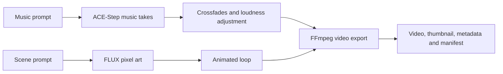

# music-gen

Generate instrumental music videos locally on an Apple Silicon Mac. Describe the
music and a scene; the pipeline creates music with ACE-Step 1.5, generates pixel
art with FLUX.1 schnell, animates the artwork, and exports a finished video with
a thumbnail, chapters, and YouTube metadata.

Built for atmospheric lo-fi and late-night instrumental mixes, with custom
prompts and BPM settings for other styles. Generation runs locally; initial
setup downloads dependencies and model weights.



- Generate several takes per prompt and combine them into a continuous mix.
- Export 1080p video with rain, passing light, flicker, grain, or fireflies.
- Resume interrupted runs using saved task IDs and stage checkpoints.
- Join finished releases into longer videos with chapter timestamps.
- Record prompts, seeds, models, dependencies, and artifacts in manifests.

The pipeline exports files for upload. It does not upload to YouTube or select
music by listening quality; review generated audio and metadata before use.

## Installation

On an **Apple Silicon Mac**, paste this single command into Terminal:

```sh
/bin/bash -c "$(curl -fsSL https://raw.githubusercontent.com/mowne67/music-gen/main/setup.sh)"
```

It installs into `music-gen` in your current folder and takes care of Homebrew
(if missing), FFmpeg, uv, Python, both environments, the pinned ACE-Step checkout,
its launcher settings, and the FLUX artwork model. Homebrew may ask for your Mac
password or Command Line Tools during its first installation.

Already cloned the repository? Run `./setup.sh` inside it instead. If setup is
interrupted, rerun the same command; completed model downloads are reused.

Allow disk space for both model sets and generated videos. Artwork weights are
about 9.6 GB; ACE-Step downloads its music models on the first generation. The
workflow was used on a Mac with 24 GB RAM. Model weights, environments, and
outputs stay outside Git.

<details>
<summary>Manual installation</summary>

Install [Homebrew](https://brew.sh/) and Git first, then:

```sh
git clone https://github.com/mowne67/music-gen.git
cd music-gen
brew install ffmpeg uv
uv venv .venv-flux --python 3.12
uv pip install --python .venv-flux/bin/python -r requirements-art.txt
git clone https://github.com/ace-step/ACE-Step-1.5.git ACE-Step-1.5
git -C ACE-Step-1.5 checkout ca1e85fe9430179831e6bc6be790c332190a3866
git -C ACE-Step-1.5 apply ../docs/acestep-macos-launcher.patch
uv sync --directory ACE-Step-1.5 --python 3.12 --locked
.venv-flux/bin/hf download dhairyashil/FLUX.1-schnell-mflux-v0.6.2-4bit \
  --local-dir models/flux-schnell-4bit
```

Apply the launcher patch once to a fresh checkout. It sets port `8002` and
disables the launcher's update check. ACE-Step uses its own Python environment;
the other scripts use `.venv-flux`. The artwork model is a community 4-bit
conversion for MFLUX.

</details>

## Generate a video

Start with one short take to check the setup:

```sh
.venv-flux/bin/python make_video.py rainy_window \
  "Instrumental lo-fi hip hop, warm electric piano, soft dusty drums, mellow bass, calm rainy-night mood. No vocals." \
  1 30 \
  --bpm 72 \
  --scene "Cozy apartment desk beside a rain-covered window at midnight, warm lamp, distant city lights" \
  --effects rain flicker grain
```

The positional arguments are `NAME`, `MUSIC_PROMPT`, `TAKES`, and
`SECONDS_PER_TAKE`. The pipeline starts ACE-Step automatically when its API is
not already running. First-time downloads and cold model loading can take time;
server diagnostics are written to `/tmp/acestep-api.log`.

For three five-minute takes with a standalone trap prompt:

```sh
.venv-flux/bin/python make_video.py midnight_train \
  "Instrumental atmospheric lo-fi trap, warm muted piano, hazy synth pads, rounded 808 bass, restrained half-time drums, subtle variations. No vocals." \
  3 300 \
  --no-style --bpm 140 \
  --scene "Inside an empty commuter train at midnight, rain streaks on the window, purple and cyan city lights outside" \
  --effects rain sweep flicker grain
```

By default, the music prompt receives the channel's warm, dusty lo-fi style.
Use `--no-style` to send your prompt without that suffix. A scene still receives
the pixel-art style defined in `art.py`.

| Option | Purpose | Default |
| --- | --- | --- |
| `--scene TEXT` | Artwork description | Music prompt |
| `--bpm N` | Requested music tempo | `72` |
| `--no-style` | Omit the music style suffix | Off |
| `--effects EFFECT ...` | Choose animation effects | Selected from prompt keywords |
| `--loop-seconds N` | Animation loop duration | `40` |
| `--animation-seed N` | Deterministic animation seed | `7` |
| `--generation-timeout N` | Polling limit per music task, in seconds | `1800` |
| `--fresh` | Generate new takes and replace the named release | Off |

Final files appear in:

```text
releases/<name>/
├── video.mp4       # Finished 1080p video with audio
├── thumbnail.png   # Pixel-art thumbnail
├── youtube.md      # Suggested title, description, chapters and tags
├── captions.srt    # Chapter labels as subtitles
└── manifest.json   # Generation inputs, provenance and checkpoints
```

Working files live in `candidates/` (music takes), `mixes/` (WAV mixes), `art/`
(artwork candidates and sidecars), and `video/` (animation loops and sidecars).
Crossfades and silence trimming make the final duration shorter than the sum of
the requested take durations.

## Run a complete mix

`monsoon_train.json` contains three scene/music prompts with three five-minute
takes per prompt: Platform 02, Rain on the Glass, and Before the City Wakes.

```sh
.venv-flux/bin/python run_monsoon_train.py
```

The runner generates the three releases and joins them as
`releases/last_train_through_the_monsoon/`. That is 45 minutes of requested audio
before trimming and crossfades. Edit `monsoon_train.json` to change the prompts,
scenes, BPM, effects, or take lengths. The final title and description are defined
in `run_monsoon_train.py`.

You can also join existing releases explicitly:

```sh
.venv-flux/bin/python join.py rainy_night_mix \
  platform_02 rain_on_the_glass before_the_city_wakes \
  --title "Rainy Night Train — Instrumental Lo-Fi Mix" \
  --blurb "Three quiet chapters for late-night coding and winding down." \
  --hashtags "#lofi #studymusic #codingmusic" \
  --tags "lofi, instrumental, rainy night, study music, coding music"
```

Takes within a release use four-second audio crossfades. Joined releases use
six-second crossfades; their video is spliced without re-encoding.

## Resume and replace

Rerun the same command to resume. Saved task IDs are checked before requesting
more music, valid completed stages are reused, and a complete matching release
is skipped without loading models. Keep the original working files so their
checkpoints can be verified.

Changing settings for an existing release is rejected. Use a new name for a new
video, or add `--fresh` to explicitly replace the named release. Fresh runs use
new take/art numbers and archive the previous manifest before publishing the
replacement. Both `join.py` and the monsoon runner also accept `--fresh`.

Videos created before manifests are protected from automatic replacement.
Joining those legacy parts is supported after checking their audio/video
durations; missing provenance is labelled `legacy_unrecorded`.

API queries and audio downloads retry transient failures up to three times.
Task submission is not automatically retried because an uncertain response
could enqueue a duplicate. Timed-out tasks remain recorded for recovery on the
next run. The timeout includes cold model loading; increase
`--generation-timeout` when needed. Standalone `gen.py` uses the
`GENERATION_TIMEOUT` environment variable for the same setting.

## Animation

Effects work on a still image. They add ambience without generating new scene
frames. A 40-second loop can include five varied passing-light sweeps, rain,
flicker, and grain; effects and timing are deterministic for the saved seed.

| Effect | Appearance |
| --- | --- |
| `rain` | Rain across the image |
| `rain=0.12,0.12,0.88,0.78` | Rain inside a rectangle, using normalized coordinates |
| `sweep` | Passing bands of light |
| `flicker` | Subtle changes in brightness |
| `grain` | Film-like noise |
| `fireflies` | Floating points of light |

To animate an existing image:

```sh
.venv-flux/bin/python animate.py art/rainy_window_1.png rain flicker grain \
  --seconds 40 --seed 7
```

Loops are rendered at 1920 × 1080 and 24 fps with H.264 and no B-frames to reduce
timestamp overlaps when cutting repeated video. Updating a script does not
automatically rerender a finished release.

## Provenance and validation

Each new manifest records the requested settings, selected take indexes, music
seeds and model IDs, planned musical metadata, art candidates and selection,
full art prompts and seeds, animation settings, upstream commit, installed
package versions, script hashes, artifact fingerprints, and checkpoint status.
Joined manifests include snapshots of their sources.

Fingerprints use file size and modification time, rather than full hashes of
multi-GB media. Seeds and versions document the inputs; they do not guarantee
identical output across machines or the stochastic music planning stage.
Joining rejects unfinished/failed source releases, changed artifacts, and
audio/video duration differences greater than 0.1 seconds.

Run the regression tests without downloading models or starting the API:

```sh
.venv-flux/bin/python -m unittest -v test_pipeline test_setup
```

The tests use small synthetic WAVs and images with real FFmpeg/ffprobe. They
cover interrupted runs, saved task recovery, corrupt downloads, numbering gaps,
legacy output protection, manifests, completed-run skips, duration mismatches,
and deterministic animation wraparound. Installer tests cover fresh setup,
reruns, interrupted downloads, and existing-file protection with mocked external
installation commands. They do not assess musical quality.

## Project files

| File | Responsibility |
| --- | --- |
| `setup.sh` | Install dependencies, configure ACE-Step, and download artwork weights |
| `make_video.py` | Generate and resume one complete release |
| `gen.py` | ACE-Step API requests, polling, and music downloads |
| `stitch.sh` | Trim and crossfade music takes |
| `art.py` | Generate and record FLUX artwork candidates |
| `animate.py` | Render pixel-art animation loops |
| `join.py` | Join finished releases and create chapters |
| `pipeline.py` | Manifests, locks, checkpoints, and artifact validation |
| `run_monsoon_train.py` | Run the three-part example mix |
| `test_pipeline.py` | Regression tests |
| `test_setup.py` | Installer recovery and file protection tests |

## Built with

- [ACE-Step 1.5](https://github.com/ace-step/ACE-Step-1.5) for music generation.
- [MFLUX](https://github.com/mflux-community/mflux) and
  [FLUX.1 schnell 4-bit weights](https://huggingface.co/dhairyashil/FLUX.1-schnell-mflux-v0.6.2-4bit)
  for local artwork generation.
- [FFmpeg](https://ffmpeg.org/) for audio processing and video encoding.
- [MLX](https://github.com/ml-explore/mlx), NumPy, and Pillow for Apple Silicon
  inference and image processing.

Upstream projects and model weights have their own licenses; they are downloaded
separately and are not included in this repository.
